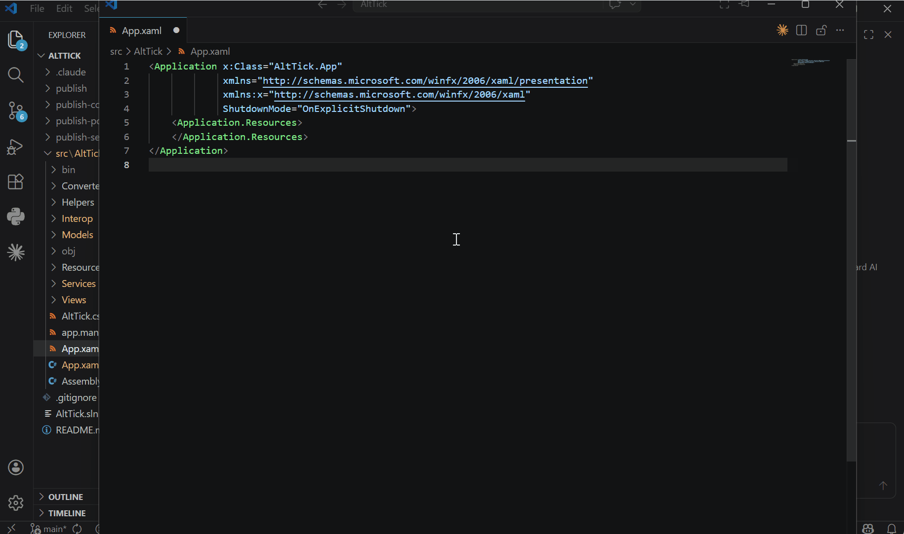

# AltTick



[English](#english) | [中文](#中文)

---

<a id="english"></a>

**Alt+\`** window switcher for Windows — switch between windows of the same application, just like macOS.


## Features

- **Alt+\`** to switch between windows of the same application
- **Live DWM thumbnails** preview for all same-app windows
- **Mouse click** to select, **hover** to highlight
- **Close windows** directly from the switcher via X button (with shrink animation)
- **Shift+\`** to cycle in reverse, **Escape** to cancel
- **System tray** with right-click menu (startup toggle, about, exit)
- Supports UWP and Win32 apps
- Single instance, PerMonitorV2 DPI aware

## Download

Go to [Releases](https://github.com/ccdr4gon/AltTick/releases) and download:

| File | Size | Requirement |
|------|------|-------------|
| `AltTick-portable.exe` | ~2 MB | Requires [.NET 8 Desktop Runtime](https://dotnet.microsoft.com/download/dotnet/8.0/runtime) installed |
| `AltTick-self-contained.exe` | ~66 MB | No dependencies, runs on any Windows 10/11 machine, but with ~1s delay on first startup due to compression |

> If you're not sure, download `AltTick-self-contained.exe` — it works out of the box.

## Usage

1. Launch `AltTick.exe` — it runs in the system tray
2. Open multiple windows of the same app (e.g. multiple Explorer or VS Code windows)
3. Hold **Alt**, press **`** to cycle through windows
4. Click a thumbnail or release **Alt** to switch to the selected window

## Build from Source

```bash
# Dev run
dotnet run --project src/AltTick

# Publish portable (~2MB, requires .NET 8 Desktop Runtime)
dotnet publish src/AltTick -c Release -r win-x64 --no-self-contained -p:PublishSingleFile=true -o publish

# Publish self-contained (~66MB, no runtime needed)
dotnet publish src/AltTick -c Release -r win-x64 --self-contained -p:PublishSingleFile=true -o publish
```

> **Note:** Do not compress the self-contained exe with external tools (UPX, 7-Zip SFX, etc.) — this will break the .NET single-file bundle. Built-in compression is already applied.

## Tech Stack

- C# / .NET 8 / WPF
- Win32 API (`SetWindowsHookEx`, `EnumWindows`, `DwmRegisterThumbnail`)
- H.NotifyIcon.Wpf (system tray)

## Credits

Created by [ccdr4gon](https://github.com/ccdr4gon), vibe-coded with [Claude Code](https://claude.ai/code) (Anthropic Claude Opus).

## License

MIT

---

<a id="中文"></a>

Windows 下的 **Alt+\`** 同应用窗口切换器，类似 macOS 的 Alt+\` 功能。

## 功能

- **Alt+\`** 在同一应用的不同窗口之间切换
- **DWM 实时缩略图** 预览所有同应用窗口
- **鼠标点击** 选择窗口，**悬停** 高亮预览
- **关闭窗口** 点击缩略图右上角 X 直接关闭（带收缩动画）
- **Shift+\`** 反向切换，**Escape** 取消
- **系统托盘** 右键菜单管理（开机启动、关于、退出）
- 支持 UWP / Win32 应用
- 单实例运行，PerMonitorV2 DPI 感知

## 下载

前往 [Releases](https://github.com/ccdr4gon/AltTick/releases) 下载：

| 文件 | 大小 | 要求 |
|------|------|------|
| `AltTick-portable.exe` | ~2 MB | 需要安装 [.NET 8 Desktop Runtime](https://dotnet.microsoft.com/download/dotnet/8.0/runtime) |
| `AltTick-self-contained.exe` | ~66 MB | 无需任何依赖，开箱即用，首次启动因解压约慢 ~1 秒 |

> 不确定选哪个？下载 `AltTick-self-contained.exe`，双击即可运行。

## 使用方法

1. 启动 `AltTick.exe`，程序驻留在系统托盘
2. 打开同一应用的多个窗口（如多个资源管理器、多个 VS Code 窗口）
3. 按住 **Alt**，按 **`** 循环选择窗口
4. 点击缩略图或松开 **Alt** 切换到选中的窗口

## 从源码构建

```bash
# 开发运行
dotnet run --project src/AltTick

# 发布便携版（~2MB，需要 .NET 8 Desktop Runtime）
dotnet publish src/AltTick -c Release -r win-x64 --no-self-contained -p:PublishSingleFile=true -o publish

# 发布自包含版（~66MB，无需安装运行时）
dotnet publish src/AltTick -c Release -r win-x64 --self-contained -p:PublishSingleFile=true -o publish
```

> **注意：** 不要用外部工具（UPX、7-Zip 自解压等）压缩自包含 exe，会破坏 .NET 单文件结构。已内置压缩。

## 技术栈

- C# / .NET 8 / WPF
- Win32 API（`SetWindowsHookEx`、`EnumWindows`、`DwmRegisterThumbnail`）
- H.NotifyIcon.Wpf（系统托盘）

## 致谢

由 [ccdr4gon](https://github.com/ccdr4gon) 创建，与 [Claude Code](https://claude.ai/code)（Anthropic Claude Opus）协作开发。

## 许可证

MIT
